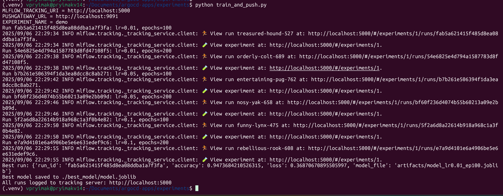
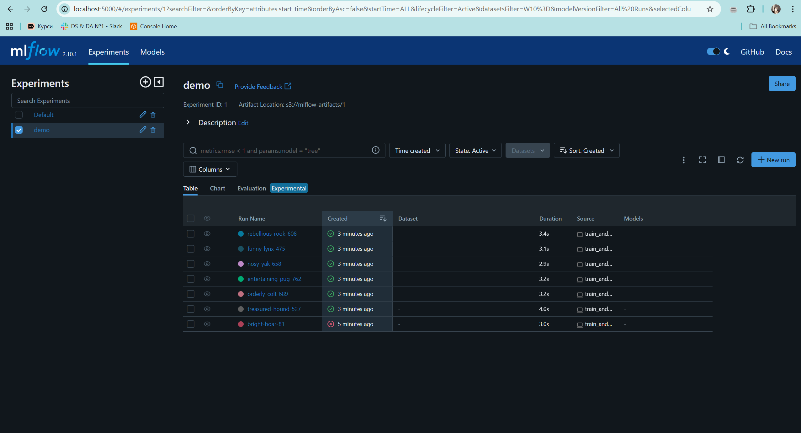
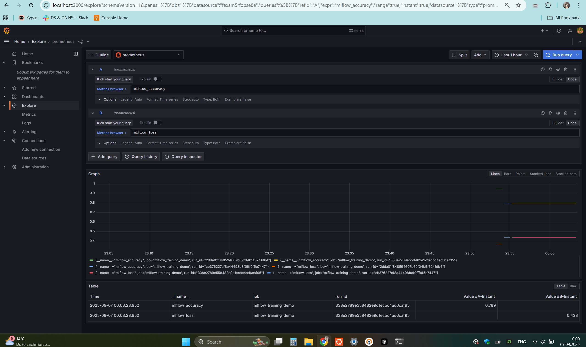

#### other

1. **Run this file:**
    ```bash
    kubectl apply -f app-of-apps.yaml
    ```
    **MLFlow-Stack,MLFlow,PostgresSQL,Minio,Grafana,PushGateway,Prometheus - all should appear as ArgoCD Application with Healthy state.**
2. **Check MLflow RUNNING:**
    ```bash
    kubectl get pods -n mlflow
    ```
3. **Check PushGateway RUNNING:**
    ```bash
    kubectl get pods -n monitoring
    ```
4. **Forward ports:**
    ```bash
    kubectl -n mlflow port-forward svc/mlflow 5000:5000
    kubectl -n mlflow port-forward svc/minio 9000:9000
    kubectl -n monitoring port-forward svc/pushgateway-prometheus-pushgateway 9091:9091
    kubectl -n monitoring port-forward svc/grafana 3000:80
    kubectl -n monitoring port-forward svc/prometheus-server 9090:80
    ```
5. **Run experiments:**
   ```bash
    cd experiments
   
    python -m venv .venv && source .venv/bin/activate
    
    pip install -r requirements.txt
    
    export MLFLOW_TRACKING_URI="http://localhost:5000"
    export PUSHGATEWAY_URL="http://localhost:9091"
    export MLFLOW_EXPERIMENT_NAME="demo"
    export AWS_ACCESS_KEY_ID=minio
    export AWS_SECRET_ACCESS_KEY=minio123
    export MLFLOW_S3_ENDPOINT_URL=http://localhost:9000
   
    python train_and_push.py
   ```
   
6. **Check https://localhost:5000 for MLFlow**
   
7. **Check https://localhost:3000 for Grafana**
#### By Default, credentials are admin/admin
   
Go to Explore, choose source prometheus, add 2 metrics - mlflow_accuracy & mlflow_loss -> click Run query 
